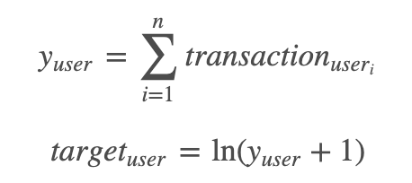
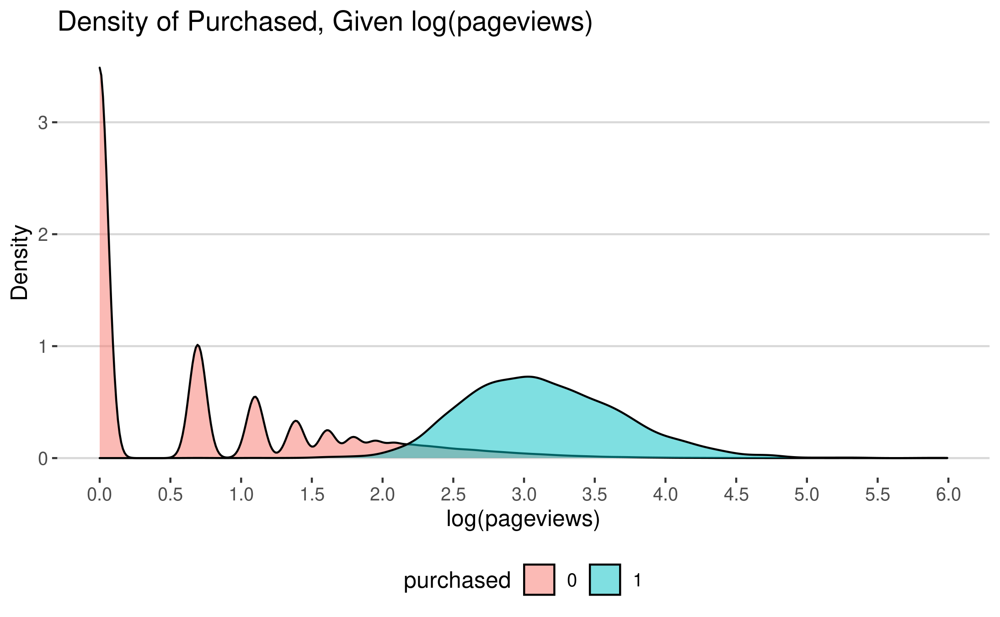
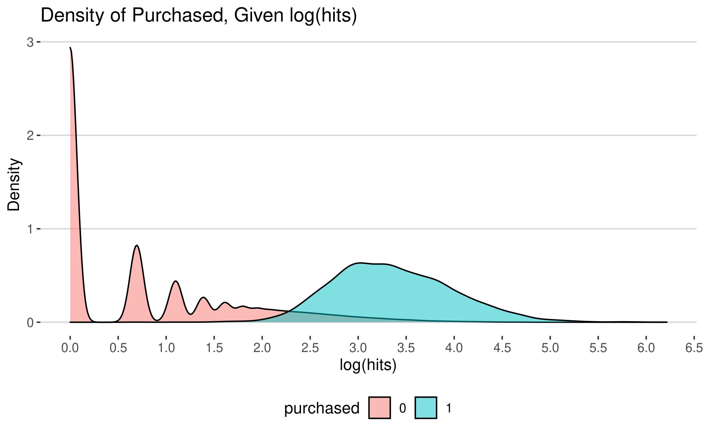
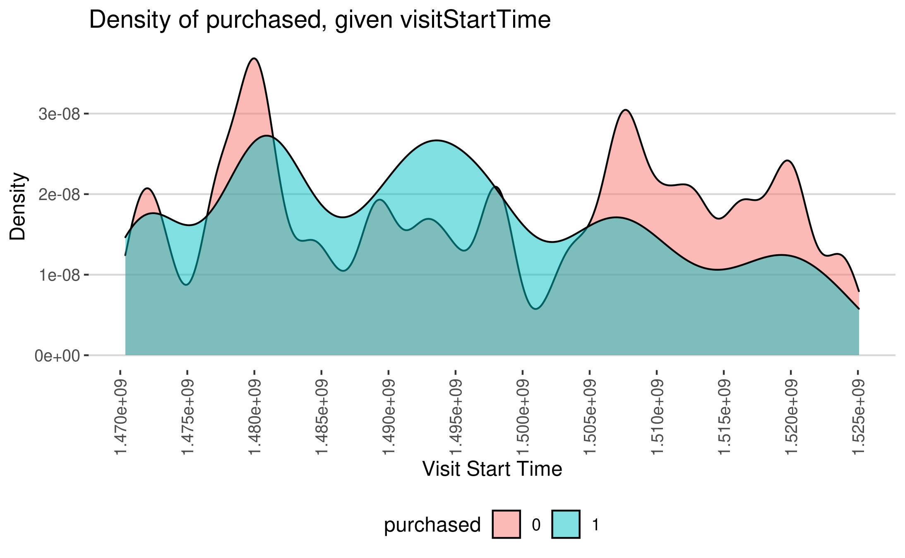
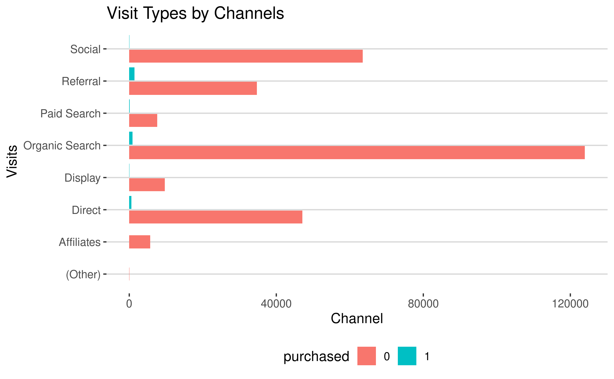
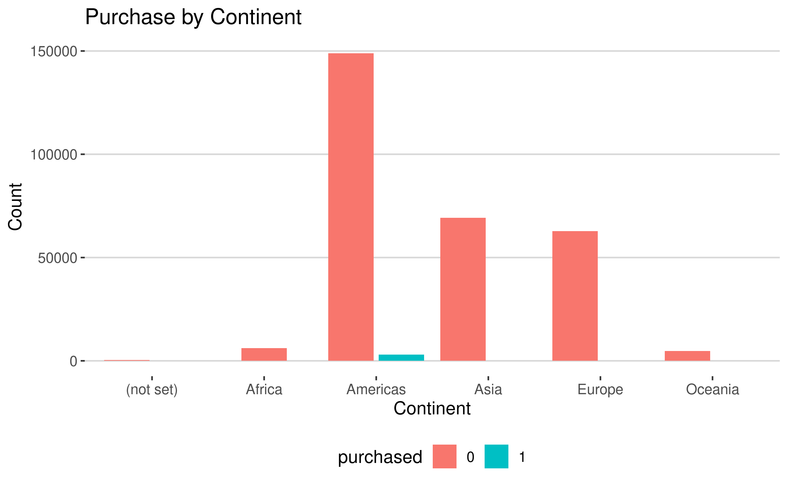
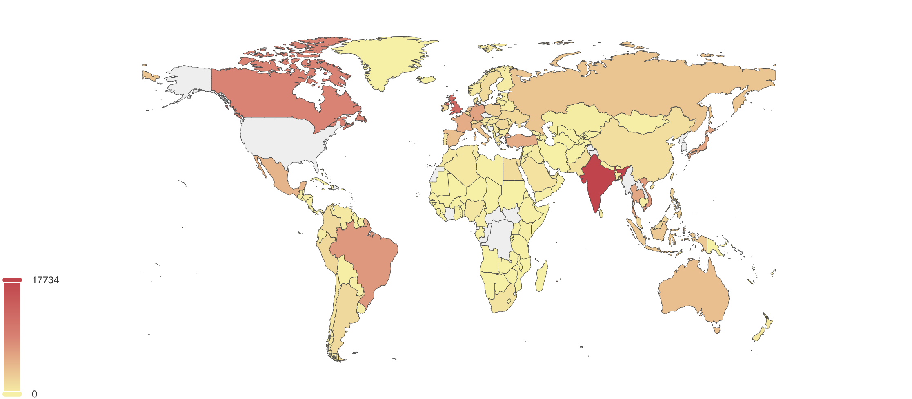
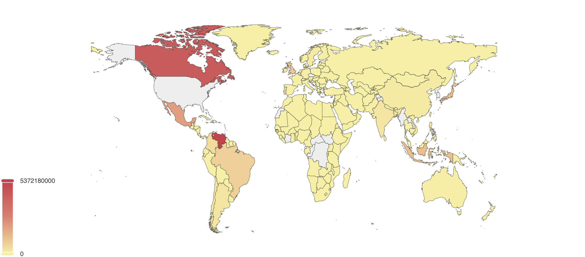

## Google Analytics Customer Revenue Prediction

### 0. Legend

* [Project Overview](https://github.com/hnguyen1174/google-analytics-revenue#1-project-overview)
* [Project Structure](https://github.com/hnguyen1174/google-analytics-revenue#2-project-structure)
* [Clone the Repository](https://github.com/hnguyen1174/google-analytics-revenue#3-clone-the-repository)
* [The Data and EDA](https://github.com/hnguyen1174/google-analytics-revenue#4-the-data-and-eda)
* [Method](https://github.com/hnguyen1174/google-analytics-revenue#4-the-data-and-eda)
* [Random Forest Model Pipeline](https://github.com/hnguyen1174/google-analytics-revenue#6-random-forest-model-pipeline)
* [Light GBM Model Pipeline](https://github.com/hnguyen1174/google-analytics-revenue#7-light-gbm-model-pipeline)
* [Insights](https://github.com/hnguyen1174/google-analytics-revenue#7-light-gbm-model-pipeline)
* [Customer Revenue Prediction App](https://github.com/hnguyen1174/google-analytics-revenue#7-light-gbm-model-pipeline)
* [Project Artifacts](https://github.com/hnguyen1174/google-analytics-revenue#7-light-gbm-model-pipeline)
* [Next Steps](https://github.com/hnguyen1174/google-analytics-revenue#7-light-gbm-model-pipeline)

### 1. Project Overview

**Overview**

For many online businesses, the 20/80 rule of marketing holds true: 20% of the customer account for 80% of the revenue. Therefore, it is vital for businesses to come up with a marketing strategy to target these customers and attract similar ones. As the first step, businesses need to be able to identify these valuable customers and understand what are the common characteristics among them. Such characteristics might even become growth drivers for online sales.

**Objective**

The objective of this project is to build a model that can predict profitable customers from online sales data. I will analyze and use data from a Google Merchandise Store (GStore), which sells Google merchandise such as shirts or hats. The datasets are available on [Kaggle]( https://www.kaggle.com/c/ga-customer-revenue-prediction). 

The aim is twofold: first, from data analysis and modelling, I hope to extract insights into which customer and app features contribute most to revenue. Second, I hope to develop a model that can predict potential revenue from a customer. These predictions can then be used for targeted marketing.

The project also has a secondary objective. I will use this project to understand more about what kinds of data and features are available from Google Analytics.

**Success Criteria**

The target for prediction is the natural log of the per-user revenue:



The success criteria is to achieve a root mean square error (RMSE) less than 0.9 on a chosen test set.

### 2. Project Structure


```
├── README.md                              <- You are here
├── app
│   ├── templates/                         <- HTML files that is templated and changes based on a set of inputs
│   ├── Dockerfile_App                     <- Dockerfile for building image to run app 
│   ├── Dockerfile_Pipeline                <- Dockerfile for building image to run the random forest model pipeline  
│
├── config                                 <- Directory for configuration files 
│   ├── logging/                           <- Configuration of python loggers
│   ├── .aws                               <- Configurations for AWS and RDS
│   ├── flaskconfig.py                     <- Configurations for Flask API
│   ├── config.yml                         <- Configurations for developing and evaluating the model
│   ├── reproducibility_test_config.yml    <- Configurations for reproducibility tests
│
├── data                                   <- Folder that contains data used or generated. 
│
├── deliverables/                          <- Presentation Slide
│
├── r_scripts/                             <- Folder that contains data processing and exploratory data analysis outputs in R
│
├── models/                                <- Trained model objects, model predictions, feature importance and model evaluations
│
├── src/                                   <- Source code for the project 
│
├── test/                                  <- Files necessary for running unit tests and reproducibility tests
│   ├── reproducibility_true/              <- expected files for reproduciblity tests
│   ├── unit_test_true                     <- input and expect files for unit tests
│
├── app.py                                 <- Flask wrapper for running the model 
├── run.py                                 <- Simplifies the execution of one or more of the src scripts  
├── requirements.txt                       <- Python package dependencies 

```

### 3. Clone the Repository

In order to run the codes and the app, you first need to clone the repo to your local machine:

```
# To clone the repo
$ git clone https://github.com/hnguyen1174/google-analytics-revenue.git

# Go to the working directory
$ cd google-analytics-revenue
```

If you want to examine and run the R scripts, please go to `r_scripts` and open the R project `google-analytics-revenue.Rproj`.

### 4. The Data and EDA

#### 4.1. The data

The raw datasets contain the following fields (taken from Kaggle):

* `fullVisitorId`: A unique identifier for each user of the Google Merchandise Store.
* `channelGrouping`: The channel via which the user came to the Store.
* `date`: The date on which the user visited the Store.
* `device`: The specifications for the device used to access the Store.
* `geoNetwork`: This section contains information about the geography of the user.
* `socialEngagementType`: Engagement type, either "Socially Engaged" or "Not Socially Engaged".
* `totals`: This section contains aggregate values across the session.
* `trafficSource`: This section contains information about the Traffic Source from which the session originated.
* `visitId`: An identifier for this session. This is part of the value usually stored as the `_utmb` cookie. **This is only unique to the user.** For a completely unique ID, you should use a combination of fullVisitorId and visitId.
* `visitNumber`: The session number for this user. If this is the first session, then this is set to 1.
* `visitStartTime`: The timestamp expressed as `POSIXtime` (in R).
* `hits`: This row and nested fields are populated for any and all types of hits. Provides a record of all page visits.
* `customDimensions`: This section contains any user-level or session-level custom dimensions that are set for a session. This is a repeated field and has an entry for each dimension that is set.
* `totals`: This set of columns mostly includes high-level aggregate data.

The target itself is a field within `totals`. It is necessary to flatten `device`, `geoNetwork`, `trafficSource` and `totals` to get additional data fields. 

There are **295,327 unique customer visits** in the **training** set, and **227,229 unique customer visits** in the **test** set. It is worth noting that I will try predict per-user revenue, and not per-visit revenue.

After flattening the data, I have got more potentially impactful features:

* **`device`** includes `browser`, `browserVersion`, `browserSize`, `operatingSystem`, `operatingSystemVersion`, `isMobile`, `mobileDeviceBranding`, `mobileDeviceModel`, `mobileInputSelector`, `mobileDeviceInfo`, `mobileDeviceMarketingName` `flashVersion`, `language`, `screenColors`, `screenResolution` and `deviceCategory`.
* **`geoNetwork`** includes `continent`, `subContinent`, `country`, `region`, `metro`, `city`, `cityId`, `networkDomain`, `latitude`, `longitude` and `networkLocation`.
* **`trafficSource`** includes `referralPath`, `campaign source`, `medium`, `keyword`, `adContent`, `isTrueDirect`, `adwordsClickInfo.criteriaParameters`, `adwordsClickInfo.page`, `adwordsClickInfo.slot`, `adwordsClickInfo.gclId`, `adwordsClickInfo.adNetworkType` and `adwordsClickInfo.isVideoAd`.
* **`totals`** includes `pageviews`, `timeOnSite`, `sessionQualityDim`, `newVisits`, `transactions` `transactionRevenue`, `totalTransactionRevenue` and `bounces`.

Again, the **true** target is `totalTransactionRevenue` (`transactionRevenue` is a deprecated field for Google Analytics and should not be looked at).

I also created a separate data field: `purchased`. This field will be 1 if `totalTransactionRevenue` is larger than 0, and 0 otherwise.

#### 4.2. EDA

I will write a comprehensive EDA later. But these are some of the most important findings:

**(1) Pageviews and hits are highly indicative of whether the user will make a purchase**




**(2) Later start time seems to indicate lower level of purchase**



**(3) Referral, organic search and direct marketing seems to increase level of purchase**



**(4) The US has both the highest number of visits and transactions; but outside of the US, India has the highest number of visits; and Canada & Venezuela (?) have the highest amount of transactions.**



Visits by Country


Transactions by Country


### 5. Methods

### 6. Random Forest Model Pipeline

### 7. Light GBM Model Pipeline

### 8. Insights

### 9. Customer Revenue Prediction App

### 10. Project Artifacts

### 11. Next Steps
